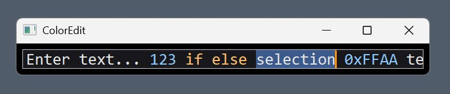

A lightweight, single-line Win32 custom edit control rendered using GDI. It features double-buffered drawing to prevent flickering, token-based syntax highlighting, smooth text selection, and standard clipboard integration. A basic Win32 application is included for quick setup. 
Note: This is resurrected old code with minimal error handling and potential bugs.  

